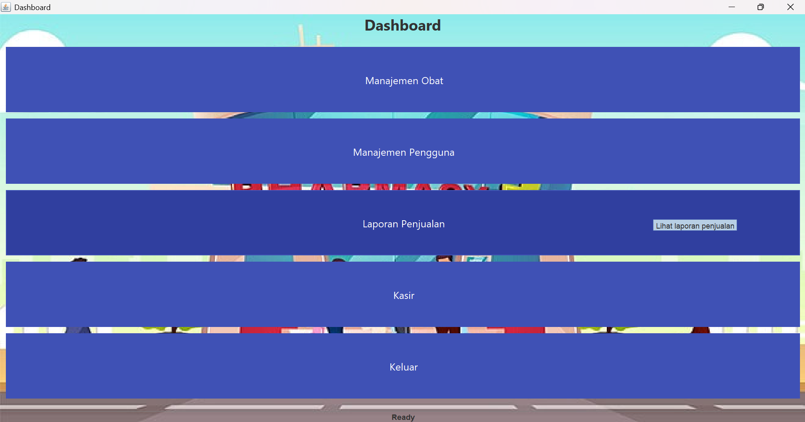
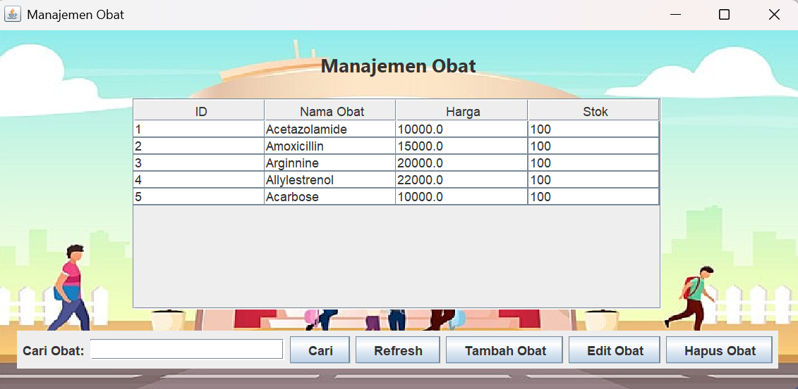
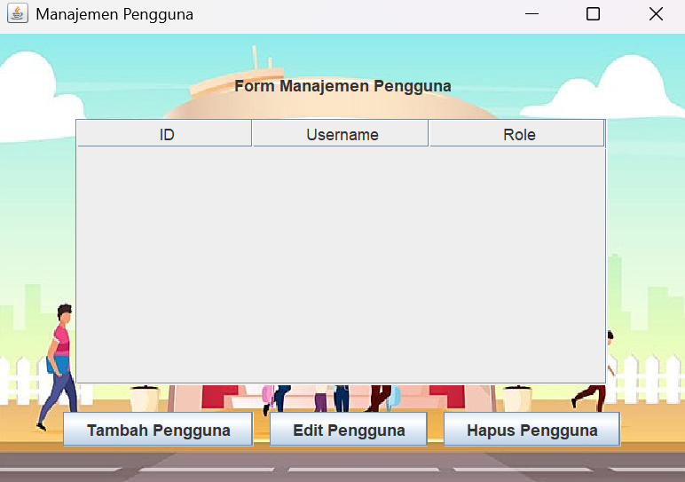
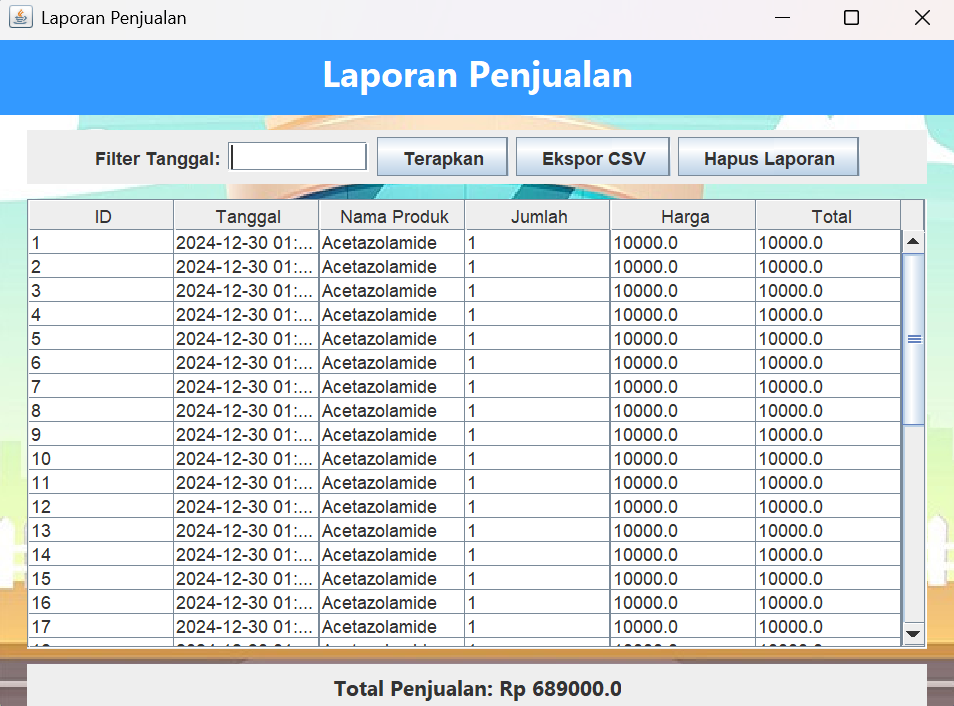
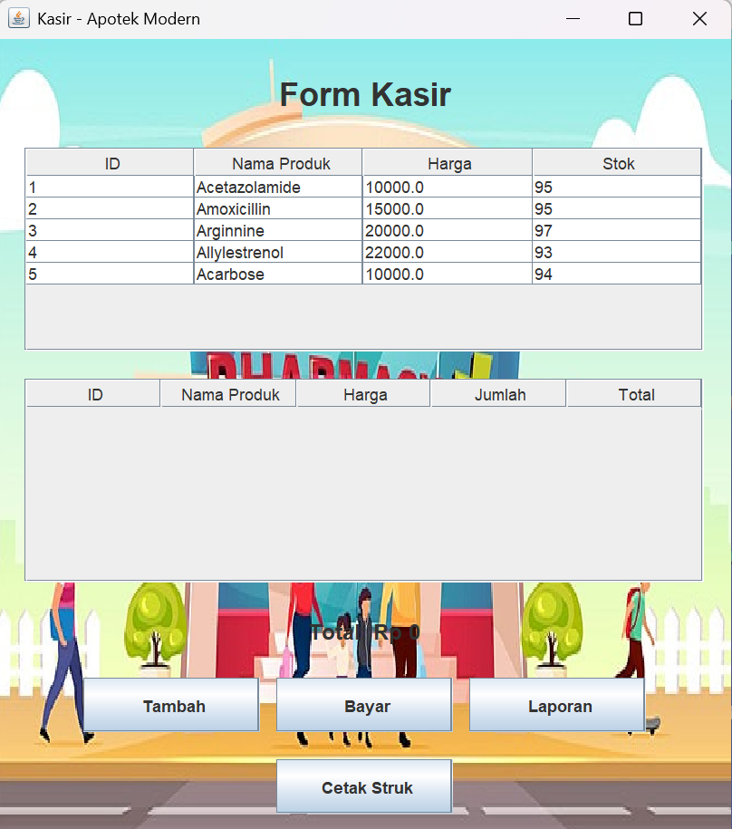

|            |                       |
| ---------- | --------------------- |
| <b> Nama   | Yudi Fermana          |
| <b> NIM    | 312210321             |
| <b> Kelas  | TI 22 A3              |
| <b> matkul | Pemrograman Visual    |

# Login


```java
/*
 * Click nbfs://nbhost/SystemFileSystem/Templates/Licenses/license-default.txt to change this license
 * Click nbfs://nbhost/SystemFileSystem/Templates/GUIForms/JFrame.java to edit this template
 */

/**
 *
 * @author mdina
 */

import config.DatabaseConnection;
import java.awt.*;
import java.sql.*;
import java.text.NumberFormat;
import java.util.Locale;
import javax.swing.*;
import javax.swing.table.DefaultTableModel;

public class CashierForm extends javax.swing.JFrame {

    private javax.swing.JTable productTable;
    private javax.swing.JTable cartTable;
    private javax.swing.table.DefaultTableModel productTableModel;
    private javax.swing.table.DefaultTableModel cartTableModel;
    private javax.swing.JLabel totalLabel;

    public CashierForm() {
        initComponents();
        loadProducts(); // Memuat produk dari database
    }

    private void initComponents() {

        JPanel backgroundPanel = new BackgroundPanel("src/icons/background.jpg"); // Path ke gambar background

        // Set layout utama
        backgroundPanel.setLayout(new BorderLayout(10, 10));
        setContentPane(backgroundPanel);

        setDefaultCloseOperation(javax.swing.WindowConstants.EXIT_ON_CLOSE);
        setTitle("Kasir - Apotek Modern");
        getContentPane().setBackground(new Color(245, 245, 245));

        // Inisialisasi tabel produk
        productTable = new javax.swing.JTable();
        productTableModel = new DefaultTableModel(
            new Object[][]{},
            new String[]{"ID", "Nama Produk", "Harga", "Stok"} // Kolom Stok ditambahkan
        );
        productTable.setModel(productTableModel);

        // Inisialisasi tabel keranjang
        cartTable = new javax.swing.JTable();
        cartTableModel = new DefaultTableModel(
            new Object[][]{},
            new String[]{"ID", "Nama Produk", "Harga", "Jumlah", "Total"}
        );
        cartTable.setModel(cartTableModel);

        // Header
        javax.swing.JLabel titleLabel = new javax.swing.JLabel("Form Kasir");
        titleLabel.setFont(new Font("SansSerif", Font.BOLD, 24));
        titleLabel.setHorizontalAlignment(javax.swing.SwingConstants.CENTER);

        // Scroll pane untuk tabel produk
        javax.swing.JScrollPane productTableScrollPane = new javax.swing.JScrollPane(productTable);

        // Scroll pane untuk tabel keranjang
        javax.swing.JScrollPane cartTableScrollPane = new javax.swing.JScrollPane(cartTable);

        // Total harga
        totalLabel = new javax.swing.JLabel("Total: Rp 0");
        totalLabel.setFont(new Font("SansSerif", Font.BOLD, 16));

        // Tambahkan tombol cetak struk
        javax.swing.JButton printReceiptButton = new javax.swing.JButton("Cetak Struk", new ImageIcon("icons/print.png"));
        printReceiptButton.addActionListener(evt -> printReceiptActionPerformed());

        // Tombol dengan ikon
        javax.swing.JButton addToCartButton = new javax.swing.JButton("Tambah", new ImageIcon("icons/add.png"));
        javax.swing.JButton completeTransactionButton = new javax.swing.JButton("Bayar", new ImageIcon("icons/pay.png"));
        javax.swing.JButton salesReportButton = new javax.swing.JButton("Laporan", new ImageIcon("icons/report.png"));

        addToCartButton.addActionListener(evt -> addToCartActionPerformed());
        completeTransactionButton.addActionListener(evt -> completeTransactionActionPerformed());
        salesReportButton.addActionListener(evt -> openSalesReportForm());

        // Layout
        javax.swing.GroupLayout layout = new javax.swing.GroupLayout(getContentPane());
        getContentPane().setLayout(layout);
        layout.setHorizontalGroup(
    layout.createParallelGroup(javax.swing.GroupLayout.Alignment.CENTER)
    .addGroup(layout.createSequentialGroup()
        .addGap(20, 20, 20)
        .addGroup(layout.createParallelGroup(javax.swing.GroupLayout.Alignment.CENTER)
            .addComponent(titleLabel, javax.swing.GroupLayout.PREFERRED_SIZE, 400, javax.swing.GroupLayout.PREFERRED_SIZE)
            .addComponent(productTableScrollPane, javax.swing.GroupLayout.PREFERRED_SIZE, 500, javax.swing.GroupLayout.PREFERRED_SIZE)
            .addComponent(cartTableScrollPane, javax.swing.GroupLayout.PREFERRED_SIZE, 500, javax.swing.GroupLayout.PREFERRED_SIZE)
            .addComponent(totalLabel)
            .addGroup(layout.createSequentialGroup()
                .addComponent(addToCartButton, javax.swing.GroupLayout.PREFERRED_SIZE, 130, javax.swing.GroupLayout.PREFERRED_SIZE)
                .addPreferredGap(javax.swing.LayoutStyle.ComponentPlacement.UNRELATED)
                .addComponent(completeTransactionButton, javax.swing.GroupLayout.PREFERRED_SIZE, 130, javax.swing.GroupLayout.PREFERRED_SIZE)
                .addPreferredGap(javax.swing.LayoutStyle.ComponentPlacement.UNRELATED)
                .addComponent(salesReportButton, javax.swing.GroupLayout.PREFERRED_SIZE, 130, javax.swing.GroupLayout.PREFERRED_SIZE))
            .addComponent(printReceiptButton, javax.swing.GroupLayout.PREFERRED_SIZE, 130, javax.swing.GroupLayout.PREFERRED_SIZE))
        .addGap(20, 20, 20))
);

layout.setVerticalGroup(
    layout.createParallelGroup(javax.swing.GroupLayout.Alignment.LEADING)
    .addGroup(layout.createSequentialGroup()
        .addGap(20, 20, 20)
        .addComponent(titleLabel, javax.swing.GroupLayout.PREFERRED_SIZE, 40, javax.swing.GroupLayout.PREFERRED_SIZE)
        .addGap(20, 20, 20)
        .addComponent(productTableScrollPane, javax.swing.GroupLayout.PREFERRED_SIZE, 150, javax.swing.GroupLayout.PREFERRED_SIZE)
        .addGap(20, 20, 20)
        .addComponent(cartTableScrollPane, javax.swing.GroupLayout.PREFERRED_SIZE, 150, javax.swing.GroupLayout.PREFERRED_SIZE)
        .addGap(20, 20, 20)
        .addComponent(totalLabel, javax.swing.GroupLayout.PREFERRED_SIZE, 30, javax.swing.GroupLayout.PREFERRED_SIZE)
        .addGap(20, 20, 20)
        .addGroup(layout.createParallelGroup(javax.swing.GroupLayout.Alignment.BASELINE)
            .addComponent(addToCartButton, javax.swing.GroupLayout.PREFERRED_SIZE, 40, javax.swing.GroupLayout.PREFERRED_SIZE)
            .addComponent(completeTransactionButton, javax.swing.GroupLayout.PREFERRED_SIZE, 40, javax.swing.GroupLayout.PREFERRED_SIZE)
            .addComponent(salesReportButton, javax.swing.GroupLayout.PREFERRED_SIZE, 40, javax.swing.GroupLayout.PREFERRED_SIZE))
        .addGap(20, 20, 20)
        .addComponent(printReceiptButton, javax.swing.GroupLayout.PREFERRED_SIZE, 40, javax.swing.GroupLayout.PREFERRED_SIZE)
        .addGap(20, 20, 20))
);


        pack();
    }
    // Tambahkan metode untuk mencetak struk
private void printReceiptActionPerformed() {
    if (cartTableModel.getRowCount() == 0) {
        JOptionPane.showMessageDialog(this, "Keranjang belanja kosong, tidak ada struk untuk dicetak.");
        return;
    }

    StringBuilder receipt = new StringBuilder();
    receipt.append("======= STRUK BELANJA =======\n");
    receipt.append("Tanggal: ").append(new java.util.Date()).append("\n\n");
    receipt.append(String.format("%-5s %-20s %-10s %-10s %-10s\n", "ID", "Nama", "Harga", "Jumlah", "Total"));
    receipt.append("---------------------------------------------\n");

    for (int i = 0; i < cartTableModel.getRowCount(); i++) {
        int productId = (Integer) cartTableModel.getValueAt(i, 0);
        String productName = (String) cartTableModel.getValueAt(i, 1);
        double price = (Double) cartTableModel.getValueAt(i, 2);
        int quantity = (Integer) cartTableModel.getValueAt(i, 3);
        double total = (Double) cartTableModel.getValueAt(i, 4);

        receipt.append(String.format("%-5d %-20s %-10.2f %-10d %-10.2f\n", productId, productName, price, quantity, total));
    }

    receipt.append("---------------------------------------------\n");
    receipt.append("Total Belanja: ").append(totalLabel.getText()).append("\n");
    receipt.append("Terima kasih atas kunjungan Anda!\n");

    JTextArea textArea = new JTextArea(receipt.toString());
    try {
        textArea.print();
    } catch (Exception e) {
        JOptionPane.showMessageDialog(this, "Terjadi kesalahan saat mencetak: " + e.getMessage());
    }
}

    private void loadProducts() {
        try (Connection conn = DatabaseConnection.connect()) {
            Statement stmt = conn.createStatement();
            String query = "SELECT * FROM medicines"; // Asumsi tabel memiliki kolom 'stock'
            ResultSet rs = stmt.executeQuery(query);

            while (rs.next()) {
                int productId = rs.getInt("medicine_id");
                String productName = rs.getString("name");
                double price = rs.getDouble("price");
                int stock = rs.getInt("stock"); // Ambil stok dari database
                Object[] row = {productId, productName, price, stock};
                productTableModel.addRow(row);
            }
        } catch (Exception e) {
            JOptionPane.showMessageDialog(this, "Terjadi kesalahan saat memuat produk: " + e.getMessage());
        }
    }

    private void addToCartActionPerformed() {
        int selectedRow = productTable.getSelectedRow();

        if (selectedRow != -1) {
            int productId = (Integer) productTableModel.getValueAt(selectedRow, 0);
            String productName = (String) productTableModel.getValueAt(selectedRow, 1);
            double price = (Double) productTableModel.getValueAt(selectedRow, 2);
            int stock = (Integer) productTableModel.getValueAt(selectedRow, 3);

            String input = JOptionPane.showInputDialog(this, "Masukkan Jumlah Produk:");
            if (input != null && !input.isEmpty()) {
                try {
                    int quantity = Integer.parseInt(input);
                    if (quantity <= 0) {
                        throw new NumberFormatException();
                    }
                    if (quantity > stock) {
                        JOptionPane.showMessageDialog(this, "Stok tidak mencukupi.");
                        return;
                    }

                    double total = price * quantity;

                    Object[] row = {productId, productName, price, quantity, total};
                    cartTableModel.addRow(row);

                    // Kurangi stok pada tabel produk
                    productTableModel.setValueAt(stock - quantity, selectedRow, 3);

                    updateTotal();
                } catch (NumberFormatException e) {
                    JOptionPane.showMessageDialog(this, "Jumlah tidak valid. Masukkan angka positif.");
                }
            }
        } else {
            JOptionPane.showMessageDialog(this, "Pilih produk untuk ditambahkan ke keranjang.");
        }
    }

    private void completeTransactionActionPerformed() {
        double totalAmount = 0;
        for (int i = 0; i < cartTableModel.getRowCount(); i++) {
            totalAmount += (Double) cartTableModel.getValueAt(i, 4);
        }

        if (totalAmount > 0) {
            saveTransactionToDatabase();
            updateProductStockInDatabase();
            JOptionPane.showMessageDialog(this, "Transaksi berhasil diselesaikan.\nTotal: Rp " + totalAmount);
            cartTableModel.setRowCount(0);
            updateTotal();
        } else {
            JOptionPane.showMessageDialog(this, "Keranjang belanja kosong.");
        }
    }

    private void updateProductStockInDatabase() {
        try (Connection conn = DatabaseConnection.connect()) {
            String query = "UPDATE medicines SET stock = ? WHERE medicine_id = ?";
            PreparedStatement pstmt = conn.prepareStatement(query);

            for (int i = 0; i < productTableModel.getRowCount(); i++) {
                int productId = (Integer) productTableModel.getValueAt(i, 0);
                int stock = (Integer) productTableModel.getValueAt(i, 3);

                pstmt.setInt(1, stock);
                pstmt.setInt(2, productId);

                pstmt.addBatch();
            }
            pstmt.executeBatch();
        } catch (Exception e) {
            JOptionPane.showMessageDialog(this, "Terjadi kesalahan saat memperbarui stok: " + e.getMessage());
        }
    }

    private void updateTotal() {
        double total = 0;
        for (int i = 0; i < cartTableModel.getRowCount(); i++) {
            total += (Double) cartTableModel.getValueAt(i, 4);
        }
        NumberFormat formatter = NumberFormat.getCurrencyInstance(new Locale("id", "ID"));
        totalLabel.setText("Total: " + formatter.format(total));
    }


    private void saveTransactionToDatabase() {
        try (Connection conn = DatabaseConnection.connect()) {
            String query = "INSERT INTO sales_report (sale_date, product_name, quantity, price, total) VALUES (?, ?, ?, ?, ?)";
            PreparedStatement pstmt = conn.prepareStatement(query);

            for (int i = 0; i < cartTableModel.getRowCount(); i++) {
                String productName = (String) cartTableModel.getValueAt(i, 1);
                int quantity = (Integer) cartTableModel.getValueAt(i, 3);
                double price = (Double) cartTableModel.getValueAt(i, 2);
                double total = (Double) cartTableModel.getValueAt(i, 4);

                pstmt.setTimestamp(1, new java.sql.Timestamp(System.currentTimeMillis()));
                pstmt.setString(2, productName);
                pstmt.setInt(3, quantity);
                pstmt.setDouble(4, price);
                pstmt.setDouble(5, total);

                pstmt.addBatch();
            }
            pstmt.executeBatch();
            JOptionPane.showMessageDialog(this, "Data transaksi berhasil disimpan.");
        } catch (Exception e) {
            JOptionPane.showMessageDialog(this, "Terjadi kesalahan saat menyimpan transaksi: " + e.getMessage());
        }
    }

    private void openSalesReportForm() {
        new SalesReportForm().setVisible(true);
    }

    class BackgroundPanel extends JPanel {
        private Image backgroundImage;

        public BackgroundPanel(String imagePath) {
            // Load gambar sebagai background
            backgroundImage = new ImageIcon(imagePath).getImage();
        }

        @Override
        protected void paintComponent(Graphics g) {
            super.paintComponent(g);
            if (backgroundImage != null) {
                g.drawImage(backgroundImage, 0, 0, getWidth(), getHeight(), this);
            }
        }
    }

    public static void main(String args[]) {
        java.awt.EventQueue.invokeLater(() -> {
            new CashierForm().setVisible(true);
        });
    }
}

```

# Dashboard



```java
/*
 * Click nbfs://nbhost/SystemFileSystem/Templates/Licenses/license-default.txt to change this license
 * Click nbfs://nbhost/SystemFileSystem/Templates/GUIForms/JFrame.java to edit this template
 */

/**
 *
 * @author mdina
 */

import java.awt.*;
import javax.swing.*;

public class DashboardForm extends JFrame {

    public DashboardForm() {
        initComponents();
    }

    private void initComponents() {
        // Background Panel
        JPanel backgroundPanel = new BackgroundPanel("src/icons/background.jpg"); // Path ke gambar background

        // Set layout utama
        backgroundPanel.setLayout(new BorderLayout(10, 10));
        setContentPane(backgroundPanel);

        JLabel titleLabel = new JLabel();
        JButton manageMedicineButton = new JButton();
        JButton userManagementButton = new JButton();
        JButton salesReportButton = new JButton();
        JButton cashierButton = new JButton();
        JButton exitButton = new JButton();

        setDefaultCloseOperation(javax.swing.WindowConstants.EXIT_ON_CLOSE);
        setTitle("Dashboard");

        // Title Label
        titleLabel.setFont(new Font("Segoe UI", Font.BOLD, 24));
        titleLabel.setHorizontalAlignment(SwingConstants.CENTER);
        titleLabel.setText("Dashboard");
        backgroundPanel.add(titleLabel, BorderLayout.NORTH);

        // Center Panel with Grid Layout
        JPanel centerPanel = new JPanel(new GridLayout(5, 1, 10, 10));
        centerPanel.setOpaque(false); // Membuat panel transparan
        centerPanel.setBorder(BorderFactory.createEmptyBorder(10, 10, 10, 10));

        // Manage Medicine Button
        manageMedicineButton.setText("Manajemen Obat");
        manageMedicineButton.setFont(new Font("Segoe UI", Font.PLAIN, 16));
        manageMedicineButton.setIcon(new ImageIcon("medicine_icon.png")); // Example icon
        manageMedicineButton.setToolTipText("Kelola data obat yang tersedia");
        manageMedicineButton.setFocusPainted(false); // Menghilangkan border focus
        manageMedicineButton.setBackground(new Color(63, 81, 181)); // Set background color
        manageMedicineButton.setForeground(Color.WHITE); // Set text color
        manageMedicineButton.setBorder(BorderFactory.createLineBorder(new Color(63, 81, 181), 2));
        manageMedicineButton.setOpaque(true);
        manageMedicineButton.setPreferredSize(new Dimension(200, 50));
        manageMedicineButton.addActionListener(evt -> new MedicineManagementForm().setVisible(true));
        manageMedicineButton.setRolloverEnabled(true); // Enable rollover effect
        manageMedicineButton.addMouseListener(new java.awt.event.MouseAdapter() {
            public void mouseEntered(java.awt.event.MouseEvent evt) {
                manageMedicineButton.setBackground(new Color(48, 63, 159)); // Rollover color
            }
            public void mouseExited(java.awt.event.MouseEvent evt) {
                manageMedicineButton.setBackground(new Color(63, 81, 181)); // Default color
            }
        });
        centerPanel.add(manageMedicineButton);

        // User Management Button
        userManagementButton.setText("Manajemen Pengguna");
        userManagementButton.setFont(new Font("Segoe UI", Font.PLAIN, 16));
        userManagementButton.setIcon(new ImageIcon("user_icon.png")); // Example icon
        userManagementButton.setToolTipText("Kelola data pengguna");
        userManagementButton.setFocusPainted(false); // Menghilangkan border focus
        userManagementButton.setBackground(new Color(63, 81, 181)); // Set background color
        userManagementButton.setForeground(Color.WHITE); // Set text color
        userManagementButton.setBorder(BorderFactory.createLineBorder(new Color(63, 81, 181), 2));
        userManagementButton.setOpaque(true);
        userManagementButton.setPreferredSize(new Dimension(200, 50));
        userManagementButton.addActionListener(evt -> new UserManagementForm().setVisible(true));
        userManagementButton.setRolloverEnabled(true);
        userManagementButton.addMouseListener(new java.awt.event.MouseAdapter() {
            public void mouseEntered(java.awt.event.MouseEvent evt) {
                userManagementButton.setBackground(new Color(48, 63, 159)); // Rollover color
            }
            public void mouseExited(java.awt.event.MouseEvent evt) {
                userManagementButton.setBackground(new Color(63, 81, 181)); // Default color
            }
        });
        centerPanel.add(userManagementButton);

        // Sales Report Button
        salesReportButton.setText("Laporan Penjualan");
        salesReportButton.setFont(new Font("Segoe UI", Font.PLAIN, 16));
        salesReportButton.setIcon(new ImageIcon("report_icon.png")); // Example icon
        salesReportButton.setToolTipText("Lihat laporan penjualan");
        salesReportButton.setFocusPainted(false); // Menghilangkan border focus
        salesReportButton.setBackground(new Color(63, 81, 181)); // Set background color
        salesReportButton.setForeground(Color.WHITE); // Set text color
        salesReportButton.setBorder(BorderFactory.createLineBorder(new Color(63, 81, 181), 2));
        salesReportButton.setOpaque(true);
        salesReportButton.setPreferredSize(new Dimension(200, 50));
        salesReportButton.addActionListener(evt -> new SalesReportForm().setVisible(true));
        salesReportButton.setRolloverEnabled(true);
        salesReportButton.addMouseListener(new java.awt.event.MouseAdapter() {
            public void mouseEntered(java.awt.event.MouseEvent evt) {
                salesReportButton.setBackground(new Color(48, 63, 159)); // Rollover color
            }
            public void mouseExited(java.awt.event.MouseEvent evt) {
                salesReportButton.setBackground(new Color(63, 81, 181)); // Default color
            }
        });
        centerPanel.add(salesReportButton);

        // Cashier Button
        cashierButton.setText("Kasir");
        cashierButton.setFont(new Font("Segoe UI", Font.PLAIN, 16));
        cashierButton.setIcon(new ImageIcon("cashier_icon.png")); // Example icon
        cashierButton.setToolTipText("Akses fungsi kasir");
        cashierButton.setFocusPainted(false); // Menghilangkan border focus
        cashierButton.setBackground(new Color(63, 81, 181)); // Set background color
        cashierButton.setForeground(Color.WHITE); // Set text color
        cashierButton.setBorder(BorderFactory.createLineBorder(new Color(63, 81, 181), 2));
        cashierButton.setOpaque(true);
        cashierButton.setPreferredSize(new Dimension(200, 50));
        cashierButton.addActionListener(evt -> new CashierForm().setVisible(true));
        cashierButton.setRolloverEnabled(true);
        cashierButton.addMouseListener(new java.awt.event.MouseAdapter() {
            public void mouseEntered(java.awt.event.MouseEvent evt) {
                cashierButton.setBackground(new Color(48, 63, 159)); // Rollover color
            }
            public void mouseExited(java.awt.event.MouseEvent evt) {
                cashierButton.setBackground(new Color(63, 81, 181)); // Default color
            }
        });
        centerPanel.add(cashierButton);

        // Exit Button
        exitButton.setText("Keluar");
        exitButton.setFont(new Font("Segoe UI", Font.PLAIN, 16));
        exitButton.setIcon(new ImageIcon("exit_icon.png")); // Example icon
        exitButton.setToolTipText("Keluar dari aplikasi");
        exitButton.setFocusPainted(false); // Menghilangkan border focus
        exitButton.setBackground(new Color(63, 81, 181)); // Set background color
        exitButton.setForeground(Color.WHITE); // Set text color
        exitButton.setBorder(BorderFactory.createLineBorder(new Color(63, 81, 181), 2));
        exitButton.setOpaque(true);
        exitButton.setPreferredSize(new Dimension(200, 50));
        exitButton.addActionListener(evt -> System.exit(0));
        exitButton.setRolloverEnabled(true);
        exitButton.addMouseListener(new java.awt.event.MouseAdapter() {
            public void mouseEntered(java.awt.event.MouseEvent evt) {
                exitButton.setBackground(new Color(48, 63, 159)); // Rollover color
            }
            public void mouseExited(java.awt.event.MouseEvent evt) {
                exitButton.setBackground(new Color(63, 81, 181)); // Default color
            }
        });
        centerPanel.add(exitButton);

        backgroundPanel.add(centerPanel, BorderLayout.CENTER);

        // Status Bar
        JLabel statusBar = new JLabel("Ready", JLabel.CENTER);
        statusBar.setBorder(BorderFactory.createLineBorder(Color.GRAY));
        backgroundPanel.add(statusBar, BorderLayout.SOUTH);

        pack();
        setSize(400, 500);
        setLocationRelativeTo(null);
    }

    public static void main(String[] args) {
        SwingUtilities.invokeLater(() -> new DashboardForm().setVisible(true));
    }
}

class BackgroundPanel extends JPanel {
    private Image backgroundImage;

    public BackgroundPanel(String imagePath) {
        // Load gambar sebagai background
        backgroundImage = new ImageIcon(imagePath).getImage();
    }

    @Override
    protected void paintComponent(Graphics g) {
        super.paintComponent(g);
        if (backgroundImage != null) {
            g.drawImage(backgroundImage, 0, 0, getWidth(), getHeight(), this);
        }
    }
}

```

# Manajemen Obat



```java
package config;

/*
 * Click nbfs://nbhost/SystemFileSystem/Templates/Licenses/license-default.txt to change this license
 * Click nbfs://nbhost/SystemFileSystem/Templates/Classes/Class.java to edit this template
 */

 import java.sql.Connection;
 import java.sql.DriverManager;
 import java.sql.Statement;
 import java.sql.ResultSet;
 import javax.swing.JOptionPane;

 public class DatabaseConnection {

     private static final String URL = "jdbc:mysql://localhost:3306/pharmacy"; // Ubah dengan nama database kamu
     private static final String USER = "root"; // Ganti dengan username database
     private static final String PASSWORD = ""; // Ganti dengan password database kamu

     public static Connection connect() throws Exception {
         try {
             // Load JDBC driver
             Class.forName("com.mysql.cj.jdbc.Driver");
             // Establish connection
             return DriverManager.getConnection(URL, USER, PASSWORD);
         } catch (Exception e) {
             throw new Exception("Koneksi Gagal: " + e.getMessage());
         }
     }

     public static void main(String[] args) {
         try (Connection conn = connect()) {
             JOptionPane.showMessageDialog(null, "Koneksi berhasil!");
             Statement stmt = conn.createStatement();
             String query = "SELECT * FROM medicines"; // Contoh query untuk mengambil data obat
             ResultSet rs = stmt.executeQuery(query);

             while (rs.next()) {
                 System.out.println("ID Obat: " + rs.getInt("medicine_id"));
                 System.out.println("Nama Obat: " + rs.getString("name"));
                 System.out.println("Harga: " + rs.getDouble("price"));
                 System.out.println("Stok: " + rs.getInt("stock_quantity"));
             }
         } catch (Exception e) {
             JOptionPane.showMessageDialog(null, "Terjadi kesalahan: " + e.getMessage());
         }
     }
 }


```

# Manajemen Pengguna



```java
/*
 * Click nbfs://nbhost/SystemFileSystem/Templates/Licenses/license-default.txt to change this license
 * Click nbfs://nbhost/SystemFileSystem/Templates/GUIForms/JFrame.java to edit this template
 */

/**
 *
 * @author mdina
 */
import config.DatabaseConnection;
import java.awt.BorderLayout;
import java.awt.Graphics;
import java.awt.Image;
import java.sql.Connection;
import java.sql.PreparedStatement;
import java.sql.ResultSet;
import java.sql.Statement;

import javax.swing.ImageIcon;
import javax.swing.JOptionPane;
import javax.swing.JPanel;
import javax.swing.table.DefaultTableModel;

public class UserManagementForm extends javax.swing.JFrame {

    private javax.swing.JTable userTable;
    private javax.swing.table.DefaultTableModel tableModel;

    public UserManagementForm() {
        initComponents();
        loadUsers();  // Memuat data pengguna dari database saat form dibuka
    }

    private void loadUsers() {
        // Mengisi tabel dengan data pengguna dari database
        try (Connection conn = config.DatabaseConnection.connect()) {
            Statement stmt = conn.createStatement();
            String query = "SELECT * FROM users";
            ResultSet rs = stmt.executeQuery(query);

            // Menghapus semua data lama di tabel
            tableModel.setRowCount(0);

            while (rs.next()) {
                Object[] row = {
                    rs.getInt("user_id"),
                    rs.getString("username"),
                    rs.getString("role")
                };
                tableModel.addRow(row);
            }
        } catch (Exception e) {
            JOptionPane.showMessageDialog(this, "Terjadi kesalahan saat memuat data pengguna: " + e.getMessage());
        }
    }

    private void initComponents() {

        JPanel backgroundPanel = new BackgroundPanel("src/icons/background.jpg"); // Path ke gambar background

        // Set layout utama
        backgroundPanel.setLayout(new BorderLayout(10, 10));
        setContentPane(backgroundPanel);

        setDefaultCloseOperation(javax.swing.WindowConstants.DISPOSE_ON_CLOSE);
        setTitle("Manajemen Pengguna");

        javax.swing.JLabel jLabel = new javax.swing.JLabel("Form Manajemen Pengguna");
        javax.swing.JButton addButton = new javax.swing.JButton("Tambah Pengguna");
        javax.swing.JButton editButton = new javax.swing.JButton("Edit Pengguna");
        javax.swing.JButton deleteButton = new javax.swing.JButton("Hapus Pengguna");

        // Tabel untuk menampilkan data pengguna
        userTable = new javax.swing.JTable();
        tableModel = new DefaultTableModel(
            new Object[][]{},
            new String[]{"ID", "Username", "Role"}
        );
        userTable.setModel(tableModel);
        javax.swing.JScrollPane tableScrollPane = new javax.swing.JScrollPane(userTable);

        addButton.addActionListener(evt -> addUserActionPerformed());
        editButton.addActionListener(evt -> editUserActionPerformed());
        deleteButton.addActionListener(evt -> deleteUserActionPerformed());

        javax.swing.GroupLayout layout = new javax.swing.GroupLayout(getContentPane());
        getContentPane().setLayout(layout);
        layout.setHorizontalGroup(
            layout.createParallelGroup(javax.swing.GroupLayout.Alignment.LEADING)
            .addGroup(layout.createSequentialGroup()
                .addGap(50, 50, 50)
                .addGroup(layout.createParallelGroup(javax.swing.GroupLayout.Alignment.CENTER)
                    .addComponent(jLabel)
                    .addComponent(tableScrollPane, javax.swing.GroupLayout.PREFERRED_SIZE, 400, javax.swing.GroupLayout.PREFERRED_SIZE)
                    .addGroup(layout.createSequentialGroup()
                        .addComponent(addButton)
                        .addPreferredGap(javax.swing.LayoutStyle.ComponentPlacement.UNRELATED)
                        .addComponent(editButton)
                        .addPreferredGap(javax.swing.LayoutStyle.ComponentPlacement.UNRELATED)
                        .addComponent(deleteButton)))
                .addContainerGap(50, Short.MAX_VALUE))
        );
        layout.setVerticalGroup(
            layout.createParallelGroup(javax.swing.GroupLayout.Alignment.LEADING)
            .addGroup(layout.createSequentialGroup()
                .addGap(30, 30, 30)
                .addComponent(jLabel)
                .addGap(18, 18, 18)
                .addComponent(tableScrollPane, javax.swing.GroupLayout.PREFERRED_SIZE, 200, javax.swing.GroupLayout.PREFERRED_SIZE)
                .addGap(20, 20, 20)
                .addGroup(layout.createParallelGroup(javax.swing.GroupLayout.Alignment.BASELINE)
                    .addComponent(addButton)
                    .addComponent(editButton)
                    .addComponent(deleteButton))
                .addContainerGap(30, Short.MAX_VALUE))
        );

        pack();
    }

    private void addUserActionPerformed() {
        String username = javax.swing.JOptionPane.showInputDialog(this, "Masukkan Username:");
        String password = javax.swing.JOptionPane.showInputDialog(this, "Masukkan Password:");
        String role = javax.swing.JOptionPane.showInputDialog(this, "Masukkan Role (Admin/User):");

        if (username != null && password != null && role != null) {
            try (Connection conn = DatabaseConnection.connect()) {
                String query = "INSERT INTO users (username, password, role) VALUES (?, ?, ?)";
                PreparedStatement stmt = conn.prepareStatement(query);
                stmt.setString(1, username);
                stmt.setString(2, password);
                stmt.setString(3, role);
                stmt.executeUpdate();

                loadUsers();  // Memuat ulang data pengguna
                JOptionPane.showMessageDialog(this, "Pengguna berhasil ditambahkan.");
            } catch (Exception e) {
                JOptionPane.showMessageDialog(this, "Terjadi kesalahan: " + e.getMessage());
            }
        }
    }

    private void editUserActionPerformed() {
        int selectedRow = userTable.getSelectedRow();

        if (selectedRow != -1) {
            int id = (Integer) tableModel.getValueAt(selectedRow, 0);
            String username = javax.swing.JOptionPane.showInputDialog(this, "Edit Username:", tableModel.getValueAt(selectedRow, 1));
            String password = javax.swing.JOptionPane.showInputDialog(this, "Edit Password:", tableModel.getValueAt(selectedRow, 2));
            String role = javax.swing.JOptionPane.showInputDialog(this, "Edit Role:", tableModel.getValueAt(selectedRow, 3));

            if (username != null && password != null && role != null) {
                try (Connection conn = DatabaseConnection.connect()) {
                    String query = "UPDATE users SET username = ?, password = ?, role = ? WHERE user_id = ?";
                    PreparedStatement stmt = conn.prepareStatement(query);
                    stmt.setString(1, username);
                    stmt.setString(2, password);
                    stmt.setString(3, role);
                    stmt.setInt(4, id);
                    stmt.executeUpdate();

                    loadUsers();  // Memuat ulang data pengguna
                    JOptionPane.showMessageDialog(this, "Pengguna berhasil diedit.");
                } catch (Exception e) {
                    JOptionPane.showMessageDialog(this, "Terjadi kesalahan: " + e.getMessage());
                }
            }
        } else {
            JOptionPane.showMessageDialog(this, "Pilih baris untuk diedit.", "Error", JOptionPane.ERROR_MESSAGE);
        }
    }

    private void deleteUserActionPerformed() {
        int selectedRow = userTable.getSelectedRow();

        if (selectedRow != -1) {
            int id = (Integer) tableModel.getValueAt(selectedRow, 0);
            try (Connection conn = DatabaseConnection.connect()) {
                String query = "DELETE FROM users WHERE user_id = ?";
                PreparedStatement stmt = conn.prepareStatement(query);
                stmt.setInt(1, id);
                stmt.executeUpdate();

                loadUsers();  // Memuat ulang data pengguna
                JOptionPane.showMessageDialog(this, "Pengguna berhasil dihapus.");
            } catch (Exception e) {
                JOptionPane.showMessageDialog(this, "Terjadi kesalahan: " + e.getMessage());
            }
        } else {
            JOptionPane.showMessageDialog(this, "Pilih baris untuk dihapus.", "Error", JOptionPane.ERROR_MESSAGE);
        }
    }

    class BackgroundPanel extends JPanel {
    private Image backgroundImage;

    public BackgroundPanel(String imagePath) {
        // Load gambar sebagai background
        backgroundImage = new ImageIcon(imagePath).getImage();
    }

    @Override
    protected void paintComponent(Graphics g) {
        super.paintComponent(g);
        if (backgroundImage != null) {
            g.drawImage(backgroundImage, 0, 0, getWidth(), getHeight(), this);
        }
    }
}


    public static void main(String args[]) {
        java.awt.EventQueue.invokeLater(new Runnable() {
            public void run() {
                new UserManagementForm().setVisible(true);
            }
        });
    }
}

```

# Laporan Penjualan



```java
/*
 * Click nbfs://nbhost/SystemFileSystem/Templates/Licenses/license-default.txt to change this license
 * Click nbfs://nbhost/SystemFileSystem/Templates/GUIForms/JFrame.java to edit this template
 */
import java.awt.BorderLayout;
import java.awt.Graphics;
import java.awt.Image;
import java.io.FileWriter;
import java.io.IOException;
import java.sql.Connection;
import java.sql.PreparedStatement;
import java.sql.ResultSet;
import java.sql.Statement;
import javax.swing.ImageIcon;
import javax.swing.JOptionPane;
import javax.swing.JPanel;

/**
 * Laporan Penjualan
 *
 * @author mdina
 */
public class SalesReportForm extends javax.swing.JFrame {
    private javax.swing.JTable reportTable;
    private javax.swing.table.DefaultTableModel reportTableModel;
    private javax.swing.JLabel totalSalesLabel;

    public SalesReportForm() {
        initComponents();
        loadSalesReport();
    }

    private void initComponents() {

        JPanel backgroundPanel = new BackgroundPanel("src/icons/background.jpg"); // Path ke gambar background

        // Set layout utama
        backgroundPanel.setLayout(new BorderLayout(10, 10));
        setContentPane(backgroundPanel);

        setDefaultCloseOperation(javax.swing.WindowConstants.DISPOSE_ON_CLOSE);
        setTitle("Laporan Penjualan");

        // Header Panel
        javax.swing.JPanel headerPanel = new javax.swing.JPanel();
        headerPanel.setBackground(new java.awt.Color(51, 153, 255));
        javax.swing.JLabel titleLabel = new javax.swing.JLabel("Laporan Penjualan");
        titleLabel.setFont(new java.awt.Font("Segoe UI", 1, 24));
        titleLabel.setForeground(java.awt.Color.WHITE);
        headerPanel.add(titleLabel);

        // Tabel Laporan
        reportTable = new javax.swing.JTable();
        reportTableModel = new javax.swing.table.DefaultTableModel(
            new Object[][]{},
            new String[]{"ID", "Tanggal", "Nama Produk", "Jumlah", "Harga", "Total"}
        );
        reportTable.setModel(reportTableModel);
        javax.swing.JScrollPane reportTableScrollPane = new javax.swing.JScrollPane(reportTable);

        // Filter Panel
        javax.swing.JPanel filterPanel = new javax.swing.JPanel();
        javax.swing.JLabel filterLabel = new javax.swing.JLabel("Filter Tanggal:");
        javax.swing.JTextField filterField = new javax.swing.JTextField(10);
        javax.swing.JButton filterButton = new javax.swing.JButton("Terapkan");
        filterButton.addActionListener(evt -> applyFilter(filterField.getText()));

        javax.swing.JButton exportButton = new javax.swing.JButton("Ekspor CSV");
        exportButton.addActionListener(evt -> exportToCSV());

        // Tambahkan tombol Hapus Laporan
        javax.swing.JButton deleteButton = new javax.swing.JButton("Hapus Laporan");
        deleteButton.addActionListener(evt -> deleteReport());

        filterPanel.add(filterLabel);
        filterPanel.add(filterField);
        filterPanel.add(filterButton);
        filterPanel.add(exportButton);
        filterPanel.add(deleteButton);  // Menambahkan tombol Hapus

        // Footer Panel
        javax.swing.JPanel footerPanel = new javax.swing.JPanel();
        totalSalesLabel = new javax.swing.JLabel("Total Penjualan: Rp 0");
        totalSalesLabel.setFont(new java.awt.Font("Segoe UI", 1, 14));
        footerPanel.add(totalSalesLabel);

        // Layout
        javax.swing.GroupLayout layout = new javax.swing.GroupLayout(getContentPane());
        getContentPane().setLayout(layout);
        layout.setHorizontalGroup(
            layout.createParallelGroup(javax.swing.GroupLayout.Alignment.LEADING)
            .addComponent(headerPanel, javax.swing.GroupLayout.DEFAULT_SIZE, javax.swing.GroupLayout.DEFAULT_SIZE, Short.MAX_VALUE)
            .addGroup(layout.createSequentialGroup()
                .addGap(20, 20, 20)
                .addGroup(layout.createParallelGroup(javax.swing.GroupLayout.Alignment.CENTER)
                    .addComponent(filterPanel)
                    .addComponent(reportTableScrollPane, javax.swing.GroupLayout.PREFERRED_SIZE, 600, javax.swing.GroupLayout.PREFERRED_SIZE)
                    .addComponent(footerPanel))
                .addGap(20, 20, 20))
        );
        layout.setVerticalGroup(
            layout.createSequentialGroup()
            .addComponent(headerPanel, javax.swing.GroupLayout.PREFERRED_SIZE, 50, javax.swing.GroupLayout.PREFERRED_SIZE)
            .addGap(10, 10, 10)
            .addComponent(filterPanel)
            .addGap(10, 10, 10)
            .addComponent(reportTableScrollPane, javax.swing.GroupLayout.PREFERRED_SIZE, 300, javax.swing.GroupLayout.PREFERRED_SIZE)
            .addGap(10, 10, 10)
            .addComponent(footerPanel)
        );

        pack();
    }

    private void loadSalesReport() {
        try (Connection conn = config.DatabaseConnection.connect()) {
            String query = "SELECT * FROM sales_report";
            try (Statement stmt = conn.createStatement(); ResultSet rs = stmt.executeQuery(query)) {
                double totalSales = 0;
                reportTableModel.setRowCount(0); // Hapus data sebelumnya

                while (rs.next()) {
                    int saleId = rs.getInt("sale_id");
                    java.sql.Timestamp saleDate = rs.getTimestamp("sale_date");
                    String productName = rs.getString("product_name");
                    int quantity = rs.getInt("quantity");
                    double price = rs.getDouble("price");
                    double total = rs.getDouble("total");

                    totalSales += total;

                    Object[] row = {saleId, saleDate, productName, quantity, price, total};
                    reportTableModel.addRow(row);
                }
                totalSalesLabel.setText("Total Penjualan: Rp " + totalSales);
            }
        } catch (Exception e) {
            JOptionPane.showMessageDialog(this, "Terjadi kesalahan saat memuat laporan penjualan: " + e.getMessage());
        }
    }

    private void applyFilter(String date) {
        try (Connection conn = config.DatabaseConnection.connect()) {
            String query = "SELECT * FROM sales_report WHERE sale_date LIKE ?";
            try (PreparedStatement stmt = conn.prepareStatement(query)) {
                stmt.setString(1, "%" + date + "%");
                try (ResultSet rs = stmt.executeQuery()) {
                    reportTableModel.setRowCount(0); // Hapus data sebelumnya
                    double totalSales = 0;

                    while (rs.next()) {
                        int saleId = rs.getInt("sale_id");
                        java.sql.Timestamp saleDate = rs.getTimestamp("sale_date");
                        String productName = rs.getString("product_name");
                        int quantity = rs.getInt("quantity");
                        double price = rs.getDouble("price");
                        double total = rs.getDouble("total");

                        totalSales += total;

                        Object[] row = {saleId, saleDate, productName, quantity, price, total};
                        reportTableModel.addRow(row);
                    }
                    totalSalesLabel.setText("Total Penjualan: Rp " + totalSales);
                }
            }
        } catch (Exception e) {
            JOptionPane.showMessageDialog(this, "Terjadi kesalahan saat menerapkan filter: " + e.getMessage());
        }
    }

    private void exportToCSV() {
        javax.swing.JFileChooser fileChooser = new javax.swing.JFileChooser();
        fileChooser.setDialogTitle("Simpan Laporan sebagai CSV");
        fileChooser.setFileFilter(new javax.swing.filechooser.FileNameExtensionFilter("CSV Files", "csv"));

        int userSelection = fileChooser.showSaveDialog(this);
        if (userSelection == javax.swing.JFileChooser.APPROVE_OPTION) {
            java.io.File fileToSave = fileChooser.getSelectedFile();

            // Tambahkan ekstensi .csv jika belum ada
            if (!fileToSave.getAbsolutePath().endsWith(".csv")) {
                fileToSave = new java.io.File(fileToSave.getAbsolutePath() + ".csv");
            }

            try (FileWriter fileWriter = new FileWriter(fileToSave)) {
                // Tulis header
                for (int i = 0; i < reportTableModel.getColumnCount(); i++) {
                    fileWriter.write(reportTableModel.getColumnName(i));
                    if (i < reportTableModel.getColumnCount() - 1) {
                        fileWriter.write(",");
                    }
                }
                fileWriter.write("\n");

                // Tulis data
                for (int row = 0; row < reportTableModel.getRowCount(); row++) {
                    for (int col = 0; col < reportTableModel.getColumnCount(); col++) {
                        fileWriter.write(reportTableModel.getValueAt(row, col).toString());
                        if (col < reportTableModel.getColumnCount() - 1) {
                            fileWriter.write(",");
                        }
                    }
                    fileWriter.write("\n");
                }

                JOptionPane.showMessageDialog(this, "Laporan berhasil disimpan sebagai " + fileToSave.getAbsolutePath());
            } catch (IOException e) {
                JOptionPane.showMessageDialog(this, "Terjadi kesalahan saat menyimpan file: " + e.getMessage());
            }
        }
    }

    private void deleteReport() {
        int selectedRow = reportTable.getSelectedRow();

        if (selectedRow != -1) {
            // Mendapatkan ID laporan yang dipilih
            int saleId = (int) reportTableModel.getValueAt(selectedRow, 0);

            int confirmation = JOptionPane.showConfirmDialog(this,
                    "Apakah Anda yakin ingin menghapus laporan dengan ID: " + saleId + "?",
                    "Konfirmasi Hapus", JOptionPane.YES_NO_OPTION);

            if (confirmation == JOptionPane.YES_OPTION) {
                try (Connection conn = config.DatabaseConnection.connect()) {
                    String query = "DELETE FROM sales_report WHERE sale_id = ?";
                    try (PreparedStatement stmt = conn.prepareStatement(query)) {
                        stmt.setInt(1, saleId);
                        int rowsAffected = stmt.executeUpdate();

                        if (rowsAffected > 0) {
                            JOptionPane.showMessageDialog(this, "Laporan berhasil dihapus.");
                            loadSalesReport(); // Muat ulang laporan setelah penghapusan
                        } else {
                            JOptionPane.showMessageDialog(this, "Laporan gagal dihapus.");
                        }
                    }
                } catch (Exception e) {
                    JOptionPane.showMessageDialog(this, "Terjadi kesalahan saat menghapus laporan: " + e.getMessage());
                }
            }
        } else {
            JOptionPane.showMessageDialog(this, "Pilih laporan yang ingin dihapus.");
        }
    }

        class BackgroundPanel extends JPanel {
    private Image backgroundImage;

    public BackgroundPanel(String imagePath) {
        // Load gambar sebagai background
        backgroundImage = new ImageIcon(imagePath).getImage();
    }

    @Override
    protected void paintComponent(Graphics g) {
        super.paintComponent(g);
        if (backgroundImage != null) {
            g.drawImage(backgroundImage, 0, 0, getWidth(), getHeight(), this);
        }
    }
}


    public static void main(String args[]) {
        java.awt.EventQueue.invokeLater(() -> new SalesReportForm().setVisible(true));
    }
}

```

# Kasir



```java
/*
 * Click nbfs://nbhost/SystemFileSystem/Templates/Licenses/license-default.txt to change this license
 * Click nbfs://nbhost/SystemFileSystem/Templates/GUIForms/JFrame.java to edit this template
 */

/**
 *
 * @author mdina
 */

import config.DatabaseConnection;
import java.awt.*;
import java.sql.*;
import java.text.NumberFormat;
import java.util.Locale;
import javax.swing.*;
import javax.swing.table.DefaultTableModel;

public class CashierForm extends javax.swing.JFrame {

    private javax.swing.JTable productTable;
    private javax.swing.JTable cartTable;
    private javax.swing.table.DefaultTableModel productTableModel;
    private javax.swing.table.DefaultTableModel cartTableModel;
    private javax.swing.JLabel totalLabel;

    public CashierForm() {
        initComponents();
        loadProducts(); // Memuat produk dari database
    }

    private void initComponents() {

        JPanel backgroundPanel = new BackgroundPanel("src/icons/background.jpg"); // Path ke gambar background

        // Set layout utama
        backgroundPanel.setLayout(new BorderLayout(10, 10));
        setContentPane(backgroundPanel);

        setDefaultCloseOperation(javax.swing.WindowConstants.EXIT_ON_CLOSE);
        setTitle("Kasir - Apotek Modern");
        getContentPane().setBackground(new Color(245, 245, 245));

        // Inisialisasi tabel produk
        productTable = new javax.swing.JTable();
        productTableModel = new DefaultTableModel(
            new Object[][]{},
            new String[]{"ID", "Nama Produk", "Harga", "Stok"} // Kolom Stok ditambahkan
        );
        productTable.setModel(productTableModel);

        // Inisialisasi tabel keranjang
        cartTable = new javax.swing.JTable();
        cartTableModel = new DefaultTableModel(
            new Object[][]{},
            new String[]{"ID", "Nama Produk", "Harga", "Jumlah", "Total"}
        );
        cartTable.setModel(cartTableModel);

        // Header
        javax.swing.JLabel titleLabel = new javax.swing.JLabel("Form Kasir");
        titleLabel.setFont(new Font("SansSerif", Font.BOLD, 24));
        titleLabel.setHorizontalAlignment(javax.swing.SwingConstants.CENTER);

        // Scroll pane untuk tabel produk
        javax.swing.JScrollPane productTableScrollPane = new javax.swing.JScrollPane(productTable);

        // Scroll pane untuk tabel keranjang
        javax.swing.JScrollPane cartTableScrollPane = new javax.swing.JScrollPane(cartTable);

        // Total harga
        totalLabel = new javax.swing.JLabel("Total: Rp 0");
        totalLabel.setFont(new Font("SansSerif", Font.BOLD, 16));

        // Tambahkan tombol cetak struk
        javax.swing.JButton printReceiptButton = new javax.swing.JButton("Cetak Struk", new ImageIcon("icons/print.png"));
        printReceiptButton.addActionListener(evt -> printReceiptActionPerformed());

        // Tombol dengan ikon
        javax.swing.JButton addToCartButton = new javax.swing.JButton("Tambah", new ImageIcon("icons/add.png"));
        javax.swing.JButton completeTransactionButton = new javax.swing.JButton("Bayar", new ImageIcon("icons/pay.png"));
        javax.swing.JButton salesReportButton = new javax.swing.JButton("Laporan", new ImageIcon("icons/report.png"));

        addToCartButton.addActionListener(evt -> addToCartActionPerformed());
        completeTransactionButton.addActionListener(evt -> completeTransactionActionPerformed());
        salesReportButton.addActionListener(evt -> openSalesReportForm());

        // Layout
        javax.swing.GroupLayout layout = new javax.swing.GroupLayout(getContentPane());
        getContentPane().setLayout(layout);
        layout.setHorizontalGroup(
    layout.createParallelGroup(javax.swing.GroupLayout.Alignment.CENTER)
    .addGroup(layout.createSequentialGroup()
        .addGap(20, 20, 20)
        .addGroup(layout.createParallelGroup(javax.swing.GroupLayout.Alignment.CENTER)
            .addComponent(titleLabel, javax.swing.GroupLayout.PREFERRED_SIZE, 400, javax.swing.GroupLayout.PREFERRED_SIZE)
            .addComponent(productTableScrollPane, javax.swing.GroupLayout.PREFERRED_SIZE, 500, javax.swing.GroupLayout.PREFERRED_SIZE)
            .addComponent(cartTableScrollPane, javax.swing.GroupLayout.PREFERRED_SIZE, 500, javax.swing.GroupLayout.PREFERRED_SIZE)
            .addComponent(totalLabel)
            .addGroup(layout.createSequentialGroup()
                .addComponent(addToCartButton, javax.swing.GroupLayout.PREFERRED_SIZE, 130, javax.swing.GroupLayout.PREFERRED_SIZE)
                .addPreferredGap(javax.swing.LayoutStyle.ComponentPlacement.UNRELATED)
                .addComponent(completeTransactionButton, javax.swing.GroupLayout.PREFERRED_SIZE, 130, javax.swing.GroupLayout.PREFERRED_SIZE)
                .addPreferredGap(javax.swing.LayoutStyle.ComponentPlacement.UNRELATED)
                .addComponent(salesReportButton, javax.swing.GroupLayout.PREFERRED_SIZE, 130, javax.swing.GroupLayout.PREFERRED_SIZE))
            .addComponent(printReceiptButton, javax.swing.GroupLayout.PREFERRED_SIZE, 130, javax.swing.GroupLayout.PREFERRED_SIZE))
        .addGap(20, 20, 20))
);

layout.setVerticalGroup(
    layout.createParallelGroup(javax.swing.GroupLayout.Alignment.LEADING)
    .addGroup(layout.createSequentialGroup()
        .addGap(20, 20, 20)
        .addComponent(titleLabel, javax.swing.GroupLayout.PREFERRED_SIZE, 40, javax.swing.GroupLayout.PREFERRED_SIZE)
        .addGap(20, 20, 20)
        .addComponent(productTableScrollPane, javax.swing.GroupLayout.PREFERRED_SIZE, 150, javax.swing.GroupLayout.PREFERRED_SIZE)
        .addGap(20, 20, 20)
        .addComponent(cartTableScrollPane, javax.swing.GroupLayout.PREFERRED_SIZE, 150, javax.swing.GroupLayout.PREFERRED_SIZE)
        .addGap(20, 20, 20)
        .addComponent(totalLabel, javax.swing.GroupLayout.PREFERRED_SIZE, 30, javax.swing.GroupLayout.PREFERRED_SIZE)
        .addGap(20, 20, 20)
        .addGroup(layout.createParallelGroup(javax.swing.GroupLayout.Alignment.BASELINE)
            .addComponent(addToCartButton, javax.swing.GroupLayout.PREFERRED_SIZE, 40, javax.swing.GroupLayout.PREFERRED_SIZE)
            .addComponent(completeTransactionButton, javax.swing.GroupLayout.PREFERRED_SIZE, 40, javax.swing.GroupLayout.PREFERRED_SIZE)
            .addComponent(salesReportButton, javax.swing.GroupLayout.PREFERRED_SIZE, 40, javax.swing.GroupLayout.PREFERRED_SIZE))
        .addGap(20, 20, 20)
        .addComponent(printReceiptButton, javax.swing.GroupLayout.PREFERRED_SIZE, 40, javax.swing.GroupLayout.PREFERRED_SIZE)
        .addGap(20, 20, 20))
);


        pack();
    }
    // Tambahkan metode untuk mencetak struk
private void printReceiptActionPerformed() {
    if (cartTableModel.getRowCount() == 0) {
        JOptionPane.showMessageDialog(this, "Keranjang belanja kosong, tidak ada struk untuk dicetak.");
        return;
    }

    StringBuilder receipt = new StringBuilder();
    receipt.append("======= STRUK BELANJA =======\n");
    receipt.append("Tanggal: ").append(new java.util.Date()).append("\n\n");
    receipt.append(String.format("%-5s %-20s %-10s %-10s %-10s\n", "ID", "Nama", "Harga", "Jumlah", "Total"));
    receipt.append("---------------------------------------------\n");

    for (int i = 0; i < cartTableModel.getRowCount(); i++) {
        int productId = (Integer) cartTableModel.getValueAt(i, 0);
        String productName = (String) cartTableModel.getValueAt(i, 1);
        double price = (Double) cartTableModel.getValueAt(i, 2);
        int quantity = (Integer) cartTableModel.getValueAt(i, 3);
        double total = (Double) cartTableModel.getValueAt(i, 4);

        receipt.append(String.format("%-5d %-20s %-10.2f %-10d %-10.2f\n", productId, productName, price, quantity, total));
    }

    receipt.append("---------------------------------------------\n");
    receipt.append("Total Belanja: ").append(totalLabel.getText()).append("\n");
    receipt.append("Terima kasih atas kunjungan Anda!\n");

    JTextArea textArea = new JTextArea(receipt.toString());
    try {
        textArea.print();
    } catch (Exception e) {
        JOptionPane.showMessageDialog(this, "Terjadi kesalahan saat mencetak: " + e.getMessage());
    }
}

    private void loadProducts() {
        try (Connection conn = DatabaseConnection.connect()) {
            Statement stmt = conn.createStatement();
            String query = "SELECT * FROM medicines"; // Asumsi tabel memiliki kolom 'stock'
            ResultSet rs = stmt.executeQuery(query);

            while (rs.next()) {
                int productId = rs.getInt("medicine_id");
                String productName = rs.getString("name");
                double price = rs.getDouble("price");
                int stock = rs.getInt("stock"); // Ambil stok dari database
                Object[] row = {productId, productName, price, stock};
                productTableModel.addRow(row);
            }
        } catch (Exception e) {
            JOptionPane.showMessageDialog(this, "Terjadi kesalahan saat memuat produk: " + e.getMessage());
        }
    }

    private void addToCartActionPerformed() {
        int selectedRow = productTable.getSelectedRow();

        if (selectedRow != -1) {
            int productId = (Integer) productTableModel.getValueAt(selectedRow, 0);
            String productName = (String) productTableModel.getValueAt(selectedRow, 1);
            double price = (Double) productTableModel.getValueAt(selectedRow, 2);
            int stock = (Integer) productTableModel.getValueAt(selectedRow, 3);

            String input = JOptionPane.showInputDialog(this, "Masukkan Jumlah Produk:");
            if (input != null && !input.isEmpty()) {
                try {
                    int quantity = Integer.parseInt(input);
                    if (quantity <= 0) {
                        throw new NumberFormatException();
                    }
                    if (quantity > stock) {
                        JOptionPane.showMessageDialog(this, "Stok tidak mencukupi.");
                        return;
                    }

                    double total = price * quantity;

                    Object[] row = {productId, productName, price, quantity, total};
                    cartTableModel.addRow(row);

                    // Kurangi stok pada tabel produk
                    productTableModel.setValueAt(stock - quantity, selectedRow, 3);

                    updateTotal();
                } catch (NumberFormatException e) {
                    JOptionPane.showMessageDialog(this, "Jumlah tidak valid. Masukkan angka positif.");
                }
            }
        } else {
            JOptionPane.showMessageDialog(this, "Pilih produk untuk ditambahkan ke keranjang.");
        }
    }

    private void completeTransactionActionPerformed() {
        double totalAmount = 0;
        for (int i = 0; i < cartTableModel.getRowCount(); i++) {
            totalAmount += (Double) cartTableModel.getValueAt(i, 4);
        }

        if (totalAmount > 0) {
            saveTransactionToDatabase();
            updateProductStockInDatabase();
            JOptionPane.showMessageDialog(this, "Transaksi berhasil diselesaikan.\nTotal: Rp " + totalAmount);
            cartTableModel.setRowCount(0);
            updateTotal();
        } else {
            JOptionPane.showMessageDialog(this, "Keranjang belanja kosong.");
        }
    }

    private void updateProductStockInDatabase() {
        try (Connection conn = DatabaseConnection.connect()) {
            String query = "UPDATE medicines SET stock = ? WHERE medicine_id = ?";
            PreparedStatement pstmt = conn.prepareStatement(query);

            for (int i = 0; i < productTableModel.getRowCount(); i++) {
                int productId = (Integer) productTableModel.getValueAt(i, 0);
                int stock = (Integer) productTableModel.getValueAt(i, 3);

                pstmt.setInt(1, stock);
                pstmt.setInt(2, productId);

                pstmt.addBatch();
            }
            pstmt.executeBatch();
        } catch (Exception e) {
            JOptionPane.showMessageDialog(this, "Terjadi kesalahan saat memperbarui stok: " + e.getMessage());
        }
    }

    private void updateTotal() {
        double total = 0;
        for (int i = 0; i < cartTableModel.getRowCount(); i++) {
            total += (Double) cartTableModel.getValueAt(i, 4);
        }
        NumberFormat formatter = NumberFormat.getCurrencyInstance(new Locale("id", "ID"));
        totalLabel.setText("Total: " + formatter.format(total));
    }


    private void saveTransactionToDatabase() {
        try (Connection conn = DatabaseConnection.connect()) {
            String query = "INSERT INTO sales_report (sale_date, product_name, quantity, price, total) VALUES (?, ?, ?, ?, ?)";
            PreparedStatement pstmt = conn.prepareStatement(query);

            for (int i = 0; i < cartTableModel.getRowCount(); i++) {
                String productName = (String) cartTableModel.getValueAt(i, 1);
                int quantity = (Integer) cartTableModel.getValueAt(i, 3);
                double price = (Double) cartTableModel.getValueAt(i, 2);
                double total = (Double) cartTableModel.getValueAt(i, 4);

                pstmt.setTimestamp(1, new java.sql.Timestamp(System.currentTimeMillis()));
                pstmt.setString(2, productName);
                pstmt.setInt(3, quantity);
                pstmt.setDouble(4, price);
                pstmt.setDouble(5, total);

                pstmt.addBatch();
            }
            pstmt.executeBatch();
            JOptionPane.showMessageDialog(this, "Data transaksi berhasil disimpan.");
        } catch (Exception e) {
            JOptionPane.showMessageDialog(this, "Terjadi kesalahan saat menyimpan transaksi: " + e.getMessage());
        }
    }

    private void openSalesReportForm() {
        new SalesReportForm().setVisible(true);
    }

    class BackgroundPanel extends JPanel {
        private Image backgroundImage;

        public BackgroundPanel(String imagePath) {
            // Load gambar sebagai background
            backgroundImage = new ImageIcon(imagePath).getImage();
        }

        @Override
        protected void paintComponent(Graphics g) {
            super.paintComponent(g);
            if (backgroundImage != null) {
                g.drawImage(backgroundImage, 0, 0, getWidth(), getHeight(), this);
            }
        }
    }

    public static void main(String args[]) {
        java.awt.EventQueue.invokeLater(() -> {
            new CashierForm().setVisible(true);
        });
    }
}
```
